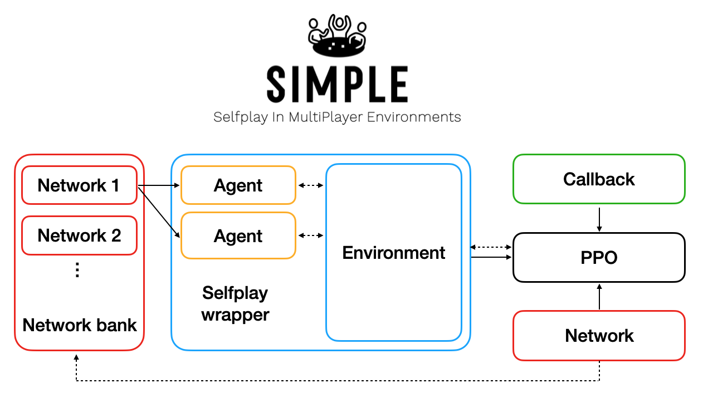

<!-- PROJECT SHIELDS -->
[![Contributors][contributors-shield]][contributors-url]
[![Forks][forks-shield]][forks-url]
[![Stargazers][stars-shield]][stars-url]
[![Issues][issues-shield]][issues-url]
[![MIT License][license-shield]][license-url]

<!-- PROJECT LOGO -->
<br />
<p align="center">
  <a href="https://github.com/davidADSP/SIMPLE">
    
  </a>

  <p align="center">
    <strong>SIMPLE-Libre</strong><br>
    Selfplay In MultiPlayer Environments — Cuba Libre Edition
    <br />
    <a href="https://github.com/davidADSP/SIMPLE/issues">Report Bug</a>
    ·
    <a href="https://github.com/davidADSP/SIMPLE/issues">Request Feature</a>
  </p>
</p>
<br>

<!-- TABLE OF CONTENTS -->
<details open>
  <summary><h2 style="display: inline-block">Table of Contents</h2></summary>
  <ol>
    <li><a href="#about-the-project">About The Project</a></li>
    <li><a href="#key-features">Key Features</a></li>
    <li>
      <a href="#getting-started">Getting Started</a>
      <ul>
        <li><a href="#prerequisites">Prerequisites</a></li>
        <li><a href="#installation">Installation</a></li>
      </ul>
    </li>
    <li><a href="#usage">Usage</a>
      <ul>
        <li><a href="#web-ui">Web UI (Play against AI)</a></li>
        <li><a href="#training">Training</a></li>
      </ul>
    </li>
    <li><a href="#architecture-and-docs">Architecture & Docs</a></li>
    <li><a href="#contributing">Contributing</a></li>
    <li><a href="#license">License</a></li>
  </ol>
</details>

<br>

---
<!-- ABOUT THE PROJECT -->
## About The Project



**SIMPLE-Libre** is an applied research project that trains AI agents to play the complex, asymmetric board game **Cuba Libre** (part of the COIN series) using self-play Reinforcement Learning. 

Originally designed as a framework for various games, this fork has been heavily specialized and modernized:
- Migrated to **Gymnasium** and **Stable-Baselines3** (PyTorch).
- Uses **MaskablePPO** to handle the highly variable, phase-dependent action spaces.
- Features a complete, rule-enforced engine for Cuba Libre, including all 48 event cards.
- Includes a rich, interactive **React + FastAPI Web UI** allowing humans to play against trained models or watch AI spectator modes.

---
## Key Features

* **Complete Cuba Libre Engine**: A 6400+ line Gymnasium environment enforcing 100% of the game rules, including Op/LimOp constraints, piece tracking, cash systems, eligibility cylinders, and phase-based target selection.
* **Complex Action Space**: `Discrete(699)` space heavily constrained by `action_masks` enforcing legal play according to the current card, faction, and board state.
* **Modern RL Stack**: Powered by Stable-Baselines3 (SB3) `MaskablePPO` inside a multi-agent self-play wrapper that cycles through the 4 asymmetric factions (Govt, M26, DR, Syndicate).
* **Interactive Dashboard**: A full React.js frontend providing an interactive SVG map, track displays, action history, and phase controls.
* **Nix Flake Support**: Fully reproducible development environment using Nix.

---
<!-- GETTING STARTED -->
## Getting Started

Follow these steps to set up the development environment, train models, or boot up the Web UI.

### Prerequisites

* **Nix** (with flakes enabled) – Recommended for a reproducible dependency environment.
* Optionally, you can just use standard **Python 3.13** and **Node.js**.

### Installation

1. Clone the repository:
   ```sh
   git clone https://github.com/davidADSP/SIMPLE.git
   cd SIMPLE
   ```

2. Enter the Nix development shell (which provides Python, Node.js, and system deps):
   ```sh
   nix develop
   ```

3. Create and activate a Python virtual environment:
   ```sh
   python -m venv .venv
   source .venv/bin/activate
   ```

4. Install the Python dependencies:
   ```sh
   pip install -r app/requirements.txt
   ```

5. Install the frontend dependencies:
   ```sh
   cd webui/frontend
   npm install
   cd ../..
   ```

---
<!-- USAGE -->
## Usage

### Web UI

The easiest way to interact with the trained Agent is via the Web UI. We provide a Fish script to automatically launch the FastAPI backend and Vite frontend.

```sh
./scripts/launch_project.fish
```

* **Frontend**: `http://127.0.0.1:5173`
* **Backend**: `http://127.0.0.1:8001`

Through the UI, you can:
* Start a new standard (or short) scenario.
* Assign any combination of the 4 factions to **Human** or **AI** control.
* Load specific trained models from the `zoo/cubalibre/` directory.
* Play through the game interactively, with the engine strictly enforcing valid targets and operations.

### Training

To train the agents via Self-Play PPO:

```sh
# Start a new training run from scratch
PYTHONPATH=app:app/environments python app/train.py -e cubalibre

# ...or use the provided Fish script for a long training session logging to tensorboard:
./scripts/train_cubalibre_long.fish
```

Training iteratively updates a pool of historic models, forcing the current PPO policy to learn robust strategies against diverse past versions of itself across all 4 asymmetric roles. 

Metrics and game history are logged to the `logs/` directory (including `training.jsonl` and `game_history.jsonl`).

---
<!-- ARCHITECTURE AND DOCS -->
## Architecture & Docs

For deeper dives into the codebase, see the following internal documentation:

* [AGENTS.md](AGENTS.md) - Project overview, file map, and core RL wrapper architecture.
* [webui/docs/ARCHITECTURE.md](webui/docs/ARCHITECTURE.md) - Communication flow between the React frontend and FastAPI backend.
* [TASKS.md](TASKS.md) - Current roadmap, verified rules, and known bugs.

---
<!-- CONTRIBUTING -->
## Contributing

Contributions are greatly appreciated. Note that this environment has a highly complex state machine to handle the asymmetric COIN ruleset.

1. Fork the Project
2. Create your Feature Branch (`git checkout -b feature/AmazingFeature`)
3. Commit your Changes (`git commit -m 'Add some AmazingFeature'`)
4. Push to the Branch (`git push origin feature/AmazingFeature`)
5. Open a Pull Request

---
<!-- LICENSE -->
## License

Distributed under the GPL-3.0 License. See `LICENSE` for more information.

---
<!-- ACKNOWLEDGEMENTS -->
## Acknowledgements

* [David Foster](https://twitter.com/davidADSP) for the original [SIMPLE framework](https://github.com/davidADSP/SIMPLE) and blog posts on multi-agent reinforcement learning.
* [Volko Ruhnke and Brian Train](https://gmtgames.com) for designing the incredible COIN series and Cuba Libre board game.

<!-- MARKDOWN LINKS & IMAGES -->
[contributors-shield]: https://img.shields.io/github/contributors/davidADSP/SIMPLE.svg?style=for-the-badge
[contributors-url]: https://github.com/davidADSP/SIMPLE/graphs/contributors
[forks-shield]: https://img.shields.io/github/forks/davidADSP/SIMPLE.svg?style=for-the-badge
[forks-url]: https://github.com/davidADSP/SIMPLE/network/members
[stars-shield]: https://img.shields.io/github/stars/davidADSP/SIMPLE.svg?style=for-the-badge
[stars-url]: https://github.com/davidADSP/SIMPLE/stargazers
[issues-shield]: https://img.shields.io/github/issues/davidADSP/SIMPLE.svg?style=for-the-badge
[issues-url]: https://github.com/davidADSP/SIMPLE/issues
[license-shield]: https://img.shields.io/github/license/davidADSP/SIMPLE.svg?style=for-the-badge
[license-url]: https://github.com/davidADSP/SIMPLE/blob/master/LICENSE.txt